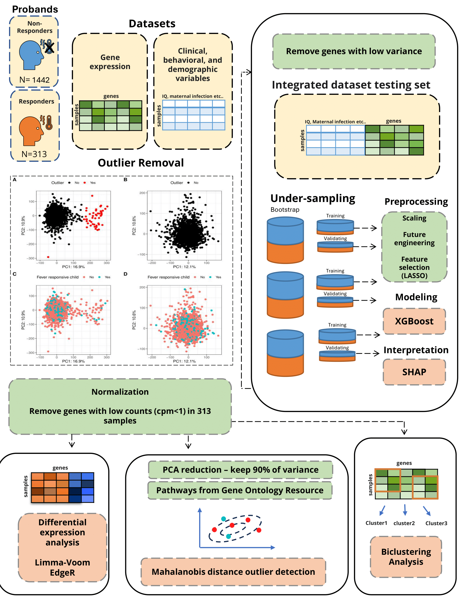

# Gene Expression Analysis in Autistic Children: Fever Effect

## Project Overview
This research project focuses on analyzing gene expression in autistic children, particularly examining the response to fever. We categorize the children into two groups: a "Fever-Affected" group, showing improvement in autistic symptoms with fever (160 children), and a "Non-Fever-Affected" group, showing no response to fever (600 children). Our analysis integrates gene expression data with additional information like age, gender, IQ, and other biomedical data to identify key genes and features associated with the fever response in autism.

## Addressing Data Imbalance
One of the significant challenges in this study is the imbalance between the two groups of children. To address this, we implement a strategy that involves:

- **Downsampling the Majority Group**: We equalize the representation of both groups by downsampling the larger group (Non-Fever-Affected), ensuring a balanced comparison.
- **Bootstrapping the Model**: To enhance the robustness of our findings, we bootstrap the model 100 times, each with 5-fold cross-validation. This approach helps in mitigating the risks of overfitting and ensures the generalizability of the model.

## Features
- Comprehensive gene expression analysis in autistic children.
- In-depth integration of demographic and biomedical data.
- Focus on understanding the fever effect in autism.
- Robust handling of data imbalance using downsampling and bootstrapping techniques.
- Utilization of advanced machine learning methods for feature selection and model training.
- Identification of critical genetic factors influencing fever response in autistic children.

## Requirements
Install the necessary Python libraries as follows:
```bash
pip install numpy pandas matplotlib scikit-learn xgboost shap
```

## Usage
Execute the script with command line arguments to specify parameters like feature selection, downsampling iterations, top features, and file paths.

Example:
```bash
python fevereffect_pipline.py --feature_selection 10,20 --downsampling 5 --top_features 10 --output_directory ./output/ --gene_expression_file ./data/gene_expression.txt --label_file ./data/children_data.csv
```

### Command Line Arguments
- `-FS`, `--feature_selection`: Options for feature selection (comma-separated).
- `-DS`, `--downsampling`: Downsampling iterations to balance the dataset.
- `-TF`, `--top_features`: Number of top features for analysis.
- `-OD`, `--output_directory`: Output directory for models and results.
- `-GE`, `--gene_expression_file`: Gene expression data file.
- `-LF`, `--label_file`: Label file with additional demographic and biomedical data.
- `-CVM`, `--cv_method`: Method for cross-validation (grid or random).

## Output
Outputs include trained models, parameters, SHAP values, and evaluation results, all stored in the specified output directory.

## Research Objective
Our goal is to uncover the genetic and environmental factors contributing to the fever effect in autism. By addressing the data imbalance through strategic downsampling and bootstrapping, we aim to ensure that our findings are both robust and representative.

## Workflow Overview



*Figure 1: This diagram illustrates the workflow of the analysis. The workflow includes the following steps:*

1. *ASD Patients*: Data is collected from two distinct groups of children, differentiated by their response to fever.
2. *Datasets*: The analysis uses a gene expression dataset alongside clinical, behavioral, and demographic data.
3. *Preprocessing*: Data is normalized, and genes with low counts or variance are removed.
4. *Differential Expression Analysis*: Using limma-EdgeR for identifying differentially expressed genes.
5. *Under-sampling and Bootstrapping*: To address data imbalance, the majority class is downsampled, and models are bootstrapped 100 times with 5-fold cross-validation.
6. *Modeling with XGBoost and SHAP*: The XGBoost algorithm is used for modeling, and SHAP is used for interpreting the model's predictions.
   

## Contributing
We welcome contributions. Please fork the repository and submit a pull request with your changes.

## License
[MIT License](LICENSE)

---
